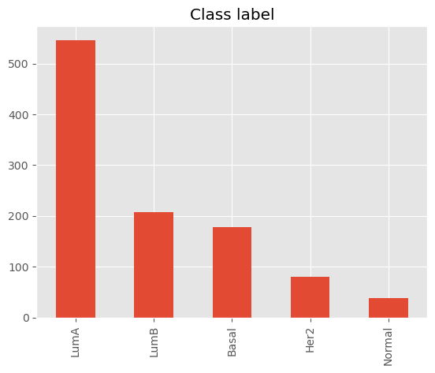

# Breast-Cancer-Analysis

## Data Exploration

The dataset contains gene expression data for **TCGA** (The Cancer Genome Atlas) breast cancer patients.
Such raw counts were obtained using the reference genome **GRCH38**. The TCGA BRCA project contains 1097 gene expression profiles, while in our dataset there is only 1053 samples whose PAM50 subtypes were already available.

The dataset is structured in the following way:

* Patients are on the rows, and 25150 protein coding genes are on the columns 
* The first column includes the TCGA ID of each patient
* The second column contains the PAM50 subtype, which can be LuminalA, LuminalB, Her2, Basal or Normal, of each patient, as publicly available on the metadata of the TCGA BRCA project 

### Class Imbalance

First thing we can inspect is whether the classed are balanced. In the case, some classes have a higher count than other e.g. LuminalA class is way more frequent than Normal class.
The aforementioned issue can affect the training process and final results, therefore, decreasing its influence is crucial and it can be done in one of the following ways:
1. Keeping the original dataset, but using other metrics such as F1-score, precision or recall
2. Resampling (over- and under- sampling) inlcudes adding or removing some samples from the dataset i.e. from the bigger classes the samples are randomly removed, while in the smaller ones new samples are added. The question is also what do we add i.e. the added sample can be just randomly repeated existing sample.
3. Generating new samples with SMOTE or Tomek links allows to create new (non-existing) samples after learning the distribution from existing samples, and these techniques usally give better results compare to the first two approaches.

### Curse of Dimensionaloty

Since the number of features is way higher than the number of samples in the dataset, using any ML model and expecting good results is far from the reality. Firstly, we cannot increase the number of samples just like that, therefore the number of features should be reduced. There are several ways to do so:
1. Feature correlation 
    Features correlation states how the features are related to each other or a target variable. The correlation can be positive or negative, but as its absolute value is higher we can say that two features are linearly correlated and that we can remove one of them.

2. Removing features with low variance

3. Feature selection 
    Feature selection is a process of selecting a set of relevant features.
    * Univariate feature selection  
        Univariate feature selection works by selecting the best features based on univariate statistical tests. Each feature is compared to the target variable, to identify whether there is any statistically significant relationship between them. It is also called analysis of variance. Methods such as *Chi-squared test* and *f-test* are usually used.

    * Recursive feature elimination  
        In this approach the features are selected recursively considering smaller and smaller sets of features. Firstly, the choosen estimator is trained on the initial set of features and the importance of each feature is obtained. The least important features are pruned from the current set of features and the procedure is repeated on the pruned set until the desired number of features (a priori defined) is selected.

4. PCA or Principle Component Analysis

## Data Preprocessing

In this project the preprocessing part consists of the following steps:
1. Making class imbalance less noticable
2. Dataset normalization (MinMax scaler)
3. Label binarization 
4. Feature selection

## Training

